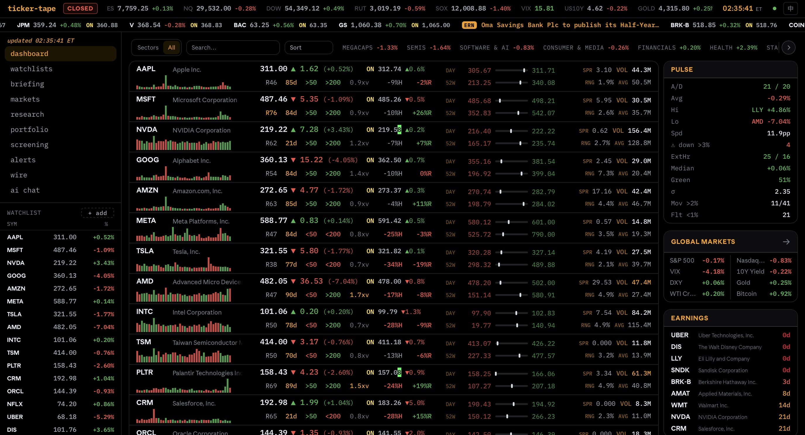

# ticker-tape-web


A Bloomberg-style market terminal in the browser — the web rebuild of a private CLI TUI. Preact + Vite + Tailwind v4, deployed on GitHub Pages, all data fetched live client-side through a Cloudflare Worker proxy.



<sub><em>The dashboard mid-session: streaming quotes with overnight prints, per-symbol technical badges, day/52-week ranges, and the pulse / global markets / earnings rail.</em></sub>

**Live:** https://jeffbai996.github.io/ticker-tape-web/

Personal project. See [LICENSE](LICENSE).

## Features

- **TUI dashboard** — ticker-by-ticker streaming prints with terminal tick flashes, after-hours quotes, volume histogram sparks, and a badge row per symbol: RSI(14), days-to-earnings, SMA50/200 flags, volume vs 20d average, % off 52-week high, 20d relative strength vs QQQ
- **Customizable widget rail** — add / remove / reorder panels (pulse, earnings, macro calendar, movers, mini charts) on the home view; layout persists per browser
- **`ticker>` command line** — the CLI grammar in the footer, with a drop-up output console and ↑/↓ history: `NVDA`, `ta AMD`, `intra TSM`, `vs AAPL MSFT`, `alert SPY > 700`, `w SHOP`, `b`, `h`
- **Status bar** — PRE / OPEN / POST / CLOSED / HOLIDAY session chip (ET, holiday-aware), global index strip that swaps to ES/NQ futures outside regular hours, VIX threshold colors, ET clock with connectivity dot, and a `LIVE / RECOVERING / DELAYED` feed-health chip; rows carry their own freshness marker, so a snapshot is never painted as a live print
- **Research** — candlestick charts (1D–5Y) with SMA/Bollinger/VWAP overlays, options chain with BS delta, earnings history + surprise impact, analyst ratings + price targets, insider activity, news
- **Options intelligence** — expected move from the ATM straddle against what the stock has actually done on past prints, IV term structure, put/call skew, volume-vs-open-interest outliers, and expected-move bands drawn on the price chart
- **Markets** — movers, sectors, heatmap, commodities, earnings week, 2026 macro calendar (FOMC/CPI/NFP/GDP/PCE)
- **Event workspace** — a calendar row opens in place into the full event: what it is in plain language, prior/consensus/actual, the public sector proxies and watched symbols it touches, and a distinct post-print surprise/reaction state
- **Screening** — multi-symbol compare, correlation matrix, valuation grid on any tickers
- **Signal boards** — saved screen definitions (field · operator · value over the technicals the feed already computes, with a rank field) rendered as a ranked board that shares the dashboard's row grammar, plus `open as watchlist` and `alert when entered`
- **Saved workspaces** — a handful of named layouts (`opening`, `research`, `event day`): active watchlist, grouping, spark shape/window, rail widgets, market subview. Switchable from the toolbar or the `ws` console verb, with versioned export/import of layout preferences. Layout only — never quotes, positions, tokens, or endpoints
- **Alerts** — price + technical (RSI / SMA cross / volume) alerts evaluated in-browser, with browser notifications
- **Watchlists** — named lists next to the main one, with opt-in cloud sync: the browser pulls, merges locally, and pushes against the revision it read, so two devices reconcile without the server arbitrating
- **AI surfaces** — public and private builds ship the same navigation. Publicly the **Briefing** / report controls and the multi-model chat workspace render as inert `PREVIEW` surfaces that never call a model; the private tailnet build activates them through its server-side router
- **Demo portfolio** — clearly-marked synthetic positions exercising the account / sizing / carry / cockpit / what-if / thesis / timeline / backtest views
- **Wire** — a news-and-events board scored by event type × watched name × freshness, running on a synthetic public session, on the **public mirror** (a sanitized headline snapshot pushed to the Worker's `/wire/*` routes and read back read-only, with the snapshot age on screen), or on a user-supplied Fragwire-compatible endpoint
- **Mobile** — bottom tab bar, spotlight-style inline search, and the `ticker>` console promoted to its own phone page (desktop keeps the floating drop-up)
- **i18n** — EN / 中文 toggle, PWA-installable

## Architecture

```
Browser (GitHub Pages, static)
  src/lib/feed.js       Yahoo WebSocket streams individual price ticks; v7
                        snapshots recover gaps and v8 fills badges + sparks
  src/lib/*             all analytics computed client-side (pure functions)
        │
        ▼
Cloudflare Worker (worker/)
  /v1 /v7 /v8 /v10 /ws  Yahoo Finance proxy; handles the cookie+crumb dance
                        (single-flight refresh, survives 401 stampedes)
  /chat                 Guarded AI streaming route retained in the Worker.
                        The public browser bundle does not call it; keys stay
                        server-side and the public AI surfaces remain inert.
  /wire/*               Public wire mirror: a sanitized headline snapshot is
                        PUSHed in and served back read-only. Every event is
                        re-validated against a seven-field contract on write.
```

No cron, no committed data, no API keys in the browser — everything is fetched live and computed on the client.

## Tech Stack

| Layer | Choice |
|-------|--------|
| UI | Preact + hash router |
| Build | Vite 8 |
| CSS | Tailwind CSS v4 (`@theme` tokens, CSS-first) |
| Charts | lightweight-charts (TradingView) + hand-rolled SVG sparks |
| Tests | Vitest (jsdom) |
| Fonts | Plus Jakarta Sans (UI) + IBM Plex Mono (data) |
| Deploy | GitHub Pages via Actions |
| Public data proxy | Cloudflare Worker (`worker/`) |
| Private AI router | Fragwire on the tailnet build |

## Commands

Node 22 is required for the build chain (Vite 8 + Tailwind v4).

```bash
npm install
npm run dev        # Vite dev server
npm run build      # production build to dist/
npm test           # Vitest
npm run budget     # build, then fail if the entry chunk drifts over budget
```

Routed pages are lazy-loaded, so the shell, dashboard, and command grammar are
the only eager chunks. `scripts/probe_matrix.py` runs the responsive matrix
against a served build (Playwright + chromium).

Worker: `cd worker && npx wrangler deploy` (needs Cloudflare credentials).

## Constraints

- **No personal data.** This is a public showcase: no real positions, accounts, or portfolio-derived symbols anywhere in source, tests, or fixtures. The portfolio section is a labeled synthetic demo.
- API keys never touch the browser. Public AI controls are previews only; the private build calls its server-side router.
- Yahoo data quirks are handled explicitly (crumb auth, ^TNX change fields, patchy earnings-calendar coverage) rather than papered over.

## Repo Layout

```
ticker-tape-web/
├── .github/workflows/deploy.yml
├── worker/              # Cloudflare Worker: Yahoo proxy, AI chat proxy, public wire mirror
├── src/
│   ├── app.jsx          # shell: status bar, tape, sidebar, command bar
│   ├── pages/           # dashboard, watchlists, brief, markets, screen, portfolio, alerts, wire, chat, console
│   │   └── research/    # research is a directory: header, overview, news, options, earnings… behind a router
│   ├── components/      # StatusBar, FeedIndicator, Tape, CommandBar, Overlay, LazyPage, WorkspacesControl…
│   └── lib/             # feed, feedHealth, yahoo, badges, eventLinks, screenDefs, workspaces, optionsIntel, wire…
├── scripts/             # bundle_budget.sh, probe_matrix.py, deploy_tailnet.sh
├── docs/                # Fable design/feature handoff + run plans
├── test/                # Vitest suites (test/lib + test/worker)
└── vite.config.js
```
